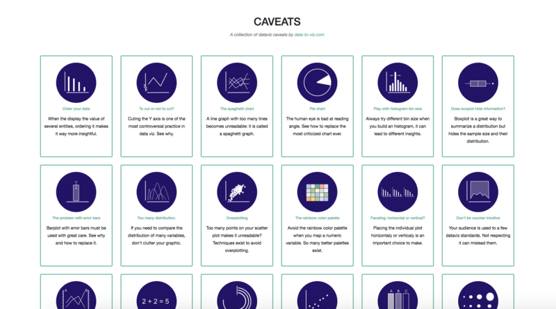

   
I’m delighted to announce a new dataviz project called ‘[Data to Viz](https://www.data-to-viz.com)’.  
—> [data-to-viz.com](https://www.data-to-viz.com)

#What it is
***

[From Data to Viz](https://www.data-to-viz.com) is a classification of chart types based on input data format. It comes in the form of a decision tree leading to a set of potentially appropriate visualizations to represent the dataset.
 
The decision trees are available in a [poster](https://www.data-to-viz.com/poster.html) that has been presented at the [UseR conference](https://user2018.r-project.org/) in Brisbane.

#Philosophy
***
The project is built on two underlying philosophies. First, that most data analysis can be summarized in about twenty different dataset formats. Second, that both data and context determine the appropriate chart.
Thus, our suggested method consists in identifying and trying all feasible chart types to find out which suits your data and idea best.
Once this set of graphic identified, [data-to-viz.com](https://www.data-to-viz.com) aims to guide you toward the best decision.

#Content
***

Several sections are available on top of the decision tree:

– [portfolio](https://www.data-to-viz.com/index.html#portfolio) : an overview of all chart possibilities. For each, an extensive description is given, showing variations, pros and cons, common pitfalls and more.

– [stories](https://www.data-to-viz.com/index.html#story) : for each input data format, a real life example is analyzed to illustrate the different chart types applicable to it.

– [caveat gallery](https://www.data-to-viz.com/caveats.html) : a list of common dataviz pitfalls, with suggested workarounds.
 

#Link with R
***
From Data to Viz aims to give general advices for data visualization in general and is not targeting [R](https://www.r-graph-gallery.com) users especialy. However, 100% of the charts are made using R, mostly using [ggplot2](https://www.r-graph-gallery.com/portfolio/ggplot2-package/) and the tidyverse. The reproducible code snippets are always available. The biggest part of the website is built using R Markdown, using a good amount of [hacks described here](https://holtzy.github.io/Pimp-my-rmd/).

The website is tightly linked with the [R graph gallery](https://www.r-graph-gallery.com/). Once you’ve identified the graphic that suits your needs, you will be redirected to the appropriate section of the gallery to get the R code in minutes.
 
 
 
#Next step
***
From Data to Viz is still in beta version, and a lot remains to be done. The [caveat gallery](http://www.data-to-viz.com/caveats.html) is incomplete and some chart types are missing. Also, a few inaccuracies may be present in the decision tree. Last but not least the English is horrible but this is not likely to change unfortunately, I apologize for that.

If you find any mistake or potential improvement, please fill an issue on [GitHub](https://github.com/holtzy/data_to_viz), contact me at [Yan.holtz.data@gmail.com](Yan.holtz.data@gmail.com) or on [twitter](https://twitter.com/R_Graph_Gallery), or leave a comment below. Any feedback will be very welcome!

 

